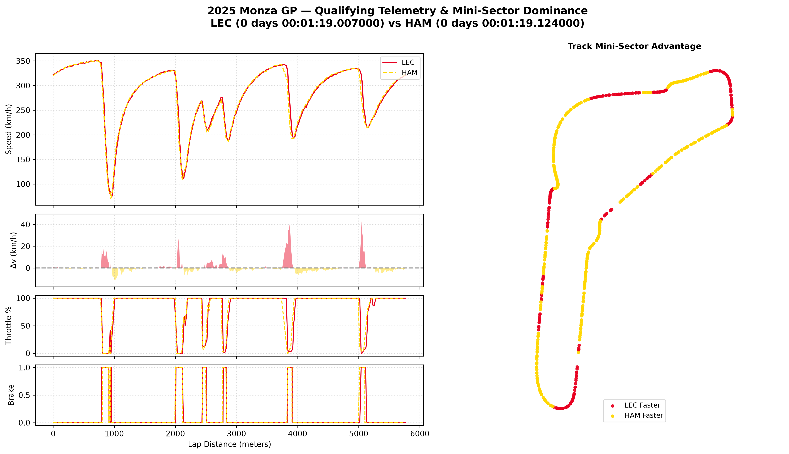

# 🏎️ F1 Telemetry & Mini-Sector Performance Analyzer

A full-stack Formula 1 telemetry analytics suite built with Python, FastF1, Matplotlib, and Streamlit[cite: 1, 2, 3]. This repository contains both a headless Matplotlib visualization script and an interactive web dashboard for granular, distance-based driver comparisons across Grand Prix sessions from 2018 through 2026.

---

## 📌 Dashboard Preview



*Figure: Teammate telemetry and spatial dominance analysis between Charles Leclerc (LEC) and Lewis Hamilton (HAM) at the 2025 Italian Grand Prix (Monza) Qualifying session.*

---

## 🚀 Key Features

- **Interactive Streamlit Dashboard (`app.py`):** Dynamic session selector querying real FIA official race calendars, sessions (`Q`, `R`, `SQ`, `FP1–3`), and participating driver lineups dynamically.
- **Pre-Configured Script (`telemetry_analyzer.py`):** Standalone analysis pipeline for rapid plotting, local caching, and high-resolution figure exports.
- **Pre-Configured Modern Roster:** Built-in name resolver matching 3-letter timing abbreviations to official driver names (covering contemporary grids up to 2026, including rookies like Antonelli, Bearman, Bortoleto, and Doohan)[cite: 1].
- **Distance-Normalized Telemetry:** Interpolates asynchronous car telemetry streams along a spatial meter axis rather than elapsed time, ensuring braking zones and apexes align accurately[cite: 1, 3].
- **Cumulative Delta-Time ($\Delta t$):** Evaluates time gained or lost meter-by-meter across the circuit via `fastf1.utils.delta_time` with numerical integration fallback[cite: 1]:
  $$\Delta t(d) = \int_0^d \left( \frac{1}{v_{\text{comparison}}(s)} - \frac{1}{v_{\text{reference}}(s)} \right) ds$$
- **Official Sector Timing Breakdown:** Extracts Sector 1, Sector 2, Sector 3, and overall lap deltas into an aligned summary table[cite: 1].
- **2D Mini-Sector Dominance Map:** Splits the circuit into 100–120 discrete spatial segments and colors the circuit layout using GPS ($X, Y$) car coordinates to show which driver held the pace advantage[cite: 1, 3].
- **Dynamic Team Liveries:** Automatically matches plotted traces to official constructor colors using FastF1's color mapping, with contrast fallbacks for teammates[cite: 1].

---

## 🛠️ Tech Stack & Dependencies

- **Language:** Python 3.10+
- **Telemetry Engine:** [`FastF1`](https://github.com/theOehrly/Fast-F1)[cite: 2]
- **Web UI:** [`Streamlit`](https://streamlit.io/)[cite: 2]
- **Data Manipulation:** `NumPy`, `Pandas`[cite: 2]
- **Plotting & Layouts:** `Matplotlib` (GridSpec multi-panel composition)[cite: 1, 2, 3]

---

## 📂 Repository Structure

```text
├── assets/
│   └── f1_combined_analysis.png  # Sample telemetry analysis preview
├── .gitignore                    # Excludes f1_cache/ and local virtual environments
├── app.py                        # Interactive Streamlit application
├── requirements.txt              # Required Python packages
├── telemetry_analyzer.py         # Standalone Matplotlib telemetry pipeline
└── README.md                     # Project documentation
